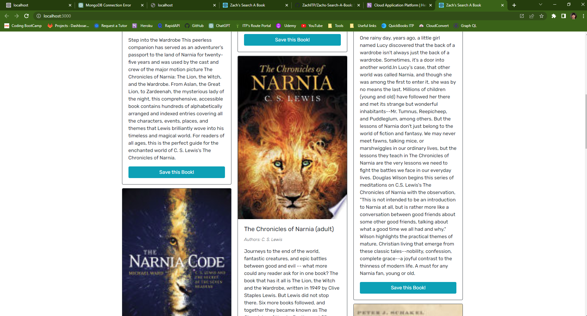
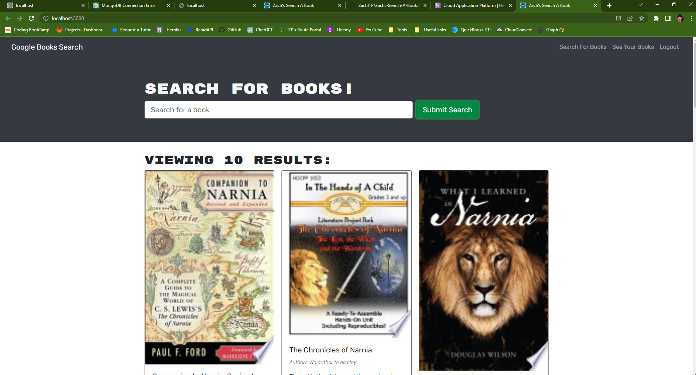

# Zachs Search A Book

[](https://opensource.org/licenses/MIT) <br>
This project is licensed under MIT, for more information please visit [this website](https://opensource.org/licenses/MIT)

## Table of Contents

- [Description](#description)
- [Technology](#Technology)
- [Installation](#installation)
- [Usage](#usage)
- [Questions](#questions)

## Description:

This application lets you search for your next good read. You can search for books and save them to your profile. You can also delete books from your profile. This application uses the Google Books API to search for books. This application was built using the MERN stack and GraphQL.

## Technology:

Project is created with:

- MongoDB
- Express.js
- React.js
- Node.js
- JavaScript
- GraphQL API
- Apollo Server

## Installation

To run this project, install it locally using npm:

```
npm install
```

## Usage

After installing npm packages, the application will be invoked by using the following command:

```
npm run develop
```


#### App Screenshot





## Questions?

Please feel free to contact me if you need any further information:

- [Email](mailto:zachhansonitp@gmail.com)
- [Github](https://github.com/ZachITP)
